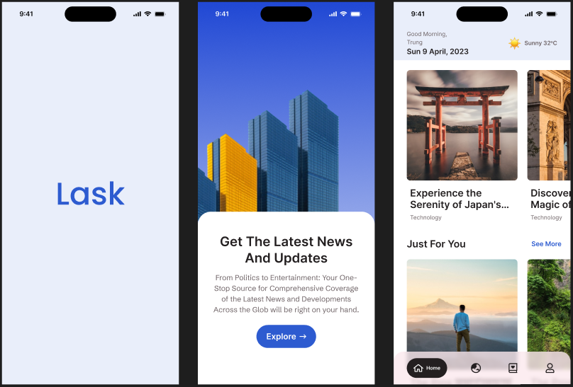
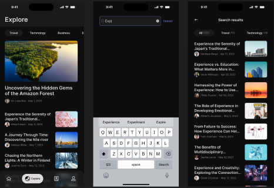

# Lask News App

<!-- Add a brief description of your app -->
Lask News App is a Flutter-based application designed to deliver the latest news articles to users.
It features a sleek UI with both light and dark theme support, ensuring a comfortable reading
experience at any time of day. The app integrates with a news API to fetch articles, providing users
with up-to-date content.

## Features

- **Light/Dark Theme Support**: Automatically switches between light and dark themes based on system
  settings or user preference.
- **API Integration**: Fetches the latest news articles from a reliable news API.
- **Native Splash Screen**: Provides a smooth and professional app launch experience.
- **State Management with Bloc**: Utilizes the Bloc pattern for efficient state management, ensuring
  a responsive and maintainable codebase.

## Screenshots

<!-- Add screenshots of your app here -->
 

## Getting Started

To get started with the app, follow these steps:

1. **Clone the Repository**:
   ```bash
   git clone https://github.com/Mariam2waleed/lask_app.git

2. **Navigate to the project Directory**:
   ```bash
   cd lask_app

3. **Install Dependencies**:
   ```bash
   flutter pub get

4. **Run the App**:
   ```bash
   flutter run

## Folder Structure

<!-- Add folder structure for your app here -->
The project follows a feature-based folder structure for better organization and maintainability.

```bash
    lib/
    ├── features/
    │   ├── home/
    │   │   ├── controller/
    │   │   │   ├── home_cubit.dart
    │   │   │   └── home_state.dart
    │   │   ├── screen/
    │   │   │   └── home_screen.dart
    │   │   └── widgets/
    │   │       └── home_widget.dart
    │   └── ...
    ├── core/
    ├── utils/
    ├── theme/
    └── main.dart
```    

## Dependencies

This project depends on the following dependencies:

1. **Main Dependencies**:
    - *flutter_bloc*: For state management using the Bloc pattern.
    - *bloc*: Core library for the Bloc pattern.
    - *dio*: For making HTTP requests to fetch news articles.
    - *intl*: For formatting dates and times "Internationalization".
    - *flutter_native_splash*: For providing a smooth and professional app launch experience.

2. **Development Dependencies**:
    - *flutter_test*: For writing tests for the app.
    - *bloc_test*: For testing Blocs.

3. **Additional Dependencies**:
    - *flutter_lints*: For enforcing coding standards and best practices.

## Flutter Configuration

To configure your project for Flutter, You can do the following:

- *uses-material-design*: Set to `true` in `pubspec.yaml` to use the Material design icons and
  theming.
- *assets*: List the directories and files to be included as assets in the project.
- *flutter_native_splash*: Specifies the image and colors for the splash screen in the both light
  and dark modes.

## Figma Design

The app's design is available on Figma. You can view and interact with the design files using the
following link:
[Figma Design Link](https://www.figma.com/design/qrNLBtoQ0jjxePgdp3Okto/Lask_App?node-id=0-1&t=L8Zy3RNqjlIMRWir-1).

## Contributing

Contributions are welcome! Please open an issue or submit a pull request for any features, bug
fixes, or enhancements.

## License

This project is licensed under the MIT License - see the [LICENSE](LICENSE) file for details.

## Contact

For any inquiries or feedback, please contact Mariam Waleed
at [Mariam2waleed@gmail.com](mailto:mariam2waleed@gmail.com).
